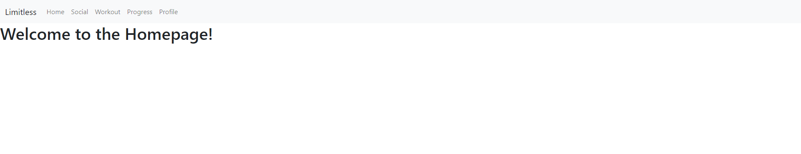

# Limitless-Webapp

## Team Limitless

IMD 2900  Team 7

### WELCOME TO LIMITLESS

Our application "Limitless" aims to provide users with a simplistic yet engaging way to record bodybuilding progress.  
Using gameifcation elements, data trackers, and thought-out UI/UX elements.  
The app is created using Django as the backend framework, and Bootstrap to create simple UI elements.  

### Current Application Status
  
  
The current application status:

1. Bootstrap implemented
2. A simple navigation bar
3. A starter homepage app and template

### Product Goal
Limitless plans, by the end of Q2, to create a bodybuilding companion application that incorporates elements from popular applications, gamification elements such as streaks and awards, social interaction with friends and leaderboards to compare weights and days gone, a simple yet extensive layout and design, and tracking and statistical elements using graphs. Solving problems from all over the fitness application market in one free web-application.

### Defenition of Done
This sprint is considered done when we (the developers) have created a design with deliberate features for the LIMITLESS web application, which demonstrates a prioritization for an enhanced user experience.