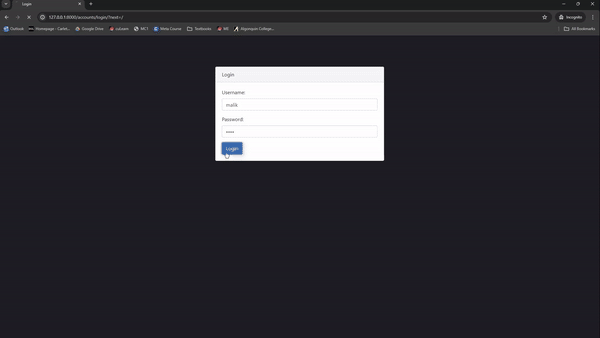

# Limitless-Webapp

## Team Limitless

IMD 2900  Team 7

### WELCOME TO LIMITLESS

Limitless is a gym companion web-application, that utilizes Django’s back-end framework. This app was made to simplify the gym tracking experience for all users. Using Django, users can create profiles in which they can store their bodybuilding progress, and interact with visualizations of their accomplishments. 

Limitless started as a web project for a class, where me and a group of other people created the foundation for the idea of Limitless. As the developer on the team, I was in charge of creating the backend models, and developing the webpage. Other members roles included team manager and graphic designer. 

I then picked up Limitless to continue it further as a solo project. I enhanced the websites UI, remade data models, and created visualizations for the user.

### Current Application Status
  

### Retrospect

Limitless accomplished most of it’s goals, allowing users to log information, through a aesthetic and cohesive layout. User’s are able to view their statistics from the table and see recent logged workouts. Each user has their own separate models and data, including stats, goals and profile picture.

Their is still some missing features that are a work in progress. The current achievement system is a prototype and not a accurate representation of user stats. The workout model and data structure is also to be redone to be more specific to each muscle.

This web-app has honed my skills in Django, HTML, CSS and JavaScript. It also allowed me to master the use of GitHub and the coding team environment.

